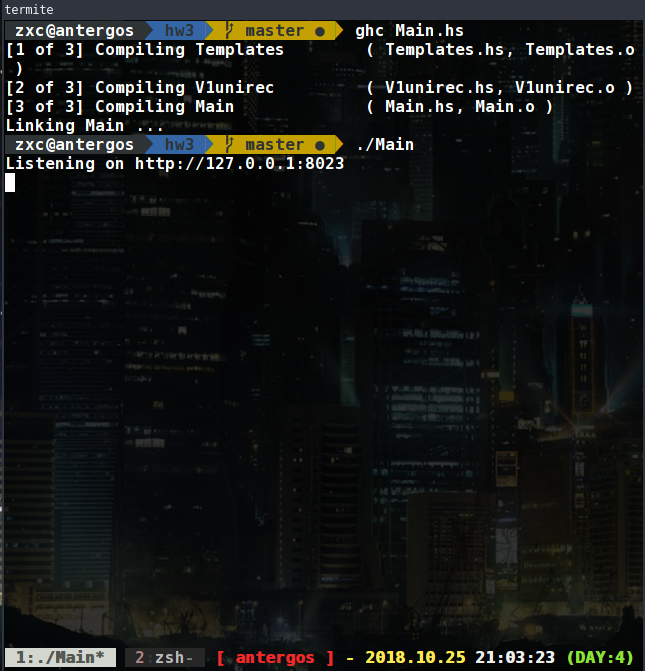
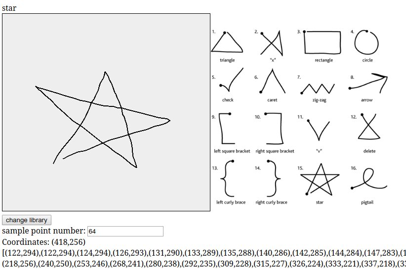
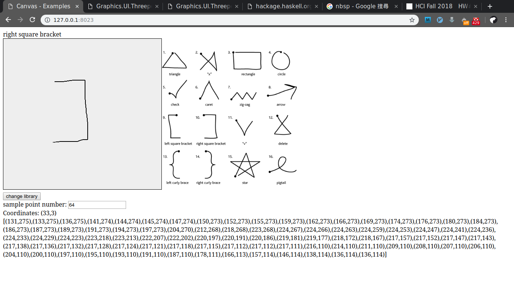
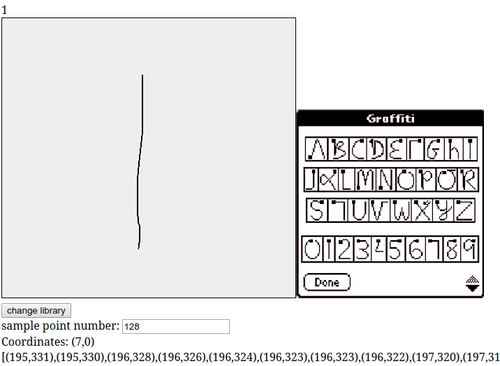
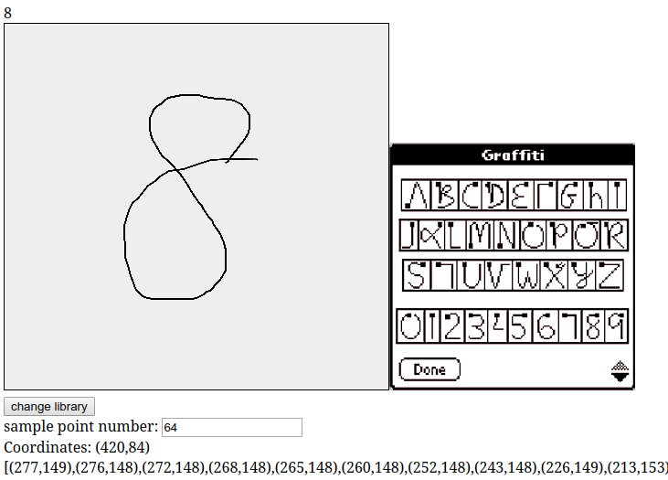

# $1 Unistroke Recognizer in Haskell

## REQUIREMENT

[ghc compiler](https://www.haskell.org/ghc/)

or run it by ghci

[threepenny-gui](http://hackage.haskell.org/package/threepenny-gui-0.8.3.0/docs/)

> you can install threepenny-gui by using cabal

```bash
   cabal install threepenny-gui -fbuildExamples
```

## HOW TO RUN

```bash
   make
```

or

```bash
   ghc Main.hs
```



## RESULT

#### unistroke



---



---

#### graffiti

目前只有支援 0 - 9 辨識 A - Z 尚未加入

以 # sample point = 128 測試 1



---

以 # sample point = 64 測試 8


